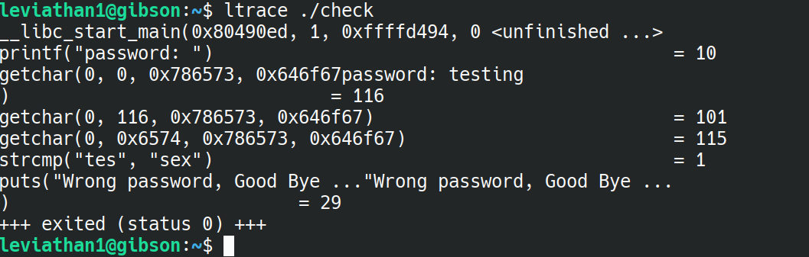
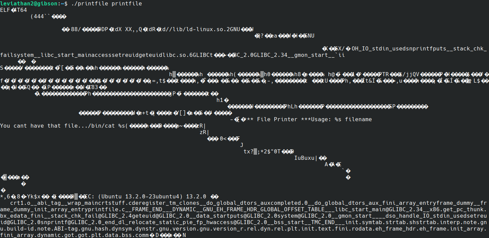
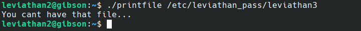
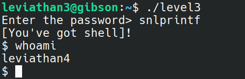

# Leviathan

## Leviathan0 --> Leviathan1

Very straightforward, just ls -a to view any hidden files in the directory.

In the .backup directory, there is a bookmarks.html file. Searching this file using 'grep' for leviathan gives us the flag.

flag=3QJ3TgzHDq


## Leviathan1 --> Leviathan2

We have an executable called 'check.' Running it prompts us for a password. Trying the password 'password' gives us "wrong password, good bye ..."

We can try to get a rough idea of how this program runs by running `ltrace`:



We can see that only the first three characters of the password are actually read in from the 3 `getchar` calls, and those characters are compared in *plain text* with 'sex' - indeed, if we try that as the password:


then we find that we are now the user leviathan2! Which means, we can probably read the password for leviathan2 by checking the passwords file.

flag=NsN1HwFoyN

## Leviathan2 --> Leviathan3

This time we are given an executable called 'printfile.' Testing this on itself, it looks like all it does is print out the contents of a file:



Also of interest, it looks like it uses `/bin/cat` to print out the contents of a file, this could definitely help us out! Trying to printfile on the leviathan3 password file:



Maybe that was wishful thinking...

Alright, let's at least try and see what else this program does. We'll make our own text files and see how printfile works on those.


Looks like it can only handle printing one file at a time.

One common issue with a lot of shell-interacting executables is how it handles whitespace and globbing, so let's mess around with that for a bit.


And the answer is that it doesn't. That is, the printfile executable tries to run 'cat' on two seperate files now... But that's interesting, because the intended use of printfile only works on one files.

Let's see if we can get printfile to run /bin/cat on the password file this way - the first file it can print out normally, and the second will be the password file:


Great success :)

flag=f0n8h2iWLP


## Leviathan3 --> Leviathan4

We are given another executable file called 'level3', which again asks for the password. Let's try what we did for leviathan1 and look at what the executable is roughly doing with `ltrace`:


Once again, a simple `strcmp` call is being made, which compares our input with 'snlprintf.' So, using that as input:



and we immediately get a shell... That seems a bit too easy.

flag=WG1egElCvO

## Leviathan4 --> Leviathan5

Once again, we run `ls -a` to find hidden files, and we come across another executable called 'bin.' When we run this, we get a sequence of binary digits:

00110000 01100100 01111001 01111000 01010100 00110111 01000110 00110100 01010001 01000100 00001010 

Where do these come from? Running `ltrace` on the executable shows that we are running "fopen" on leviathan5.


My guess, then, is that we have simply binary encoded the flag. Converting the binary to ASCII gives:

flag=0dyxT7F4QD


## Leviathan5 --> Leviathan6

Another executable. This time, on running, it prints out "cannot find /tmp/file.log." So, creating my own file.log, and once again running executable, we get:


It simply prints out the file. Interestingly, it also deletes the file.log after reading it.

Running `stat` on the executable, we see that it is indeed owned by leviathan6. Somehow, we'll have to the contents of `/etc/leviathan_pass/leviathan6` into file.log, and print it out.

One way we could do this is symlinking:


It's as easy as that :)

flag=szo7HDB88w

## Leviathan6 --> Leviathan7

We're given an executable that requires a four digit code. Four digit codes are, by their nature, not very secure. So, let's try brute force it!

Here's a very straightforward python script that does that for us:

```python
#!/usr/bin/env python3
import os
for i in range(0, 10000):
  print(f"Trying {i}:")
  os.system(f"~/leviathan6 {i}")

```
Running this, the python program stops when we are "trying 7123," so there's our passcode. We get given a shell, and that let's us `cat leviathan7`. 

flag=qEs5Io5yM8


