# NARNIA

## Narnia0 --> Narnia1:
Pretty simple to begin with, we run `./narnia1` and are presented with a prompt asking us to change a variable  of value `0x41414141` (which I recognise as the ASCII for `AAAA`) to have the value `0xdeadbeef`.

We'll first try to find where this variable lives by entering into our buffer the classic `AAAABBBBCCCCDDDD`...

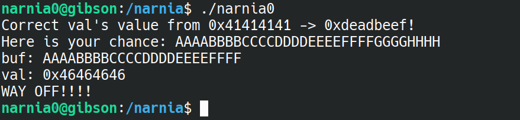

We see that the overwritten value is `1x46464646` or `FFFF`, so that's where we should insert the values `0xefbeadde` (the appropriate endianess for the value `0xdeadbeef` which is desired).

To do this, we write a quick python script using pwntoos, which I'll call pwnarnia1.py

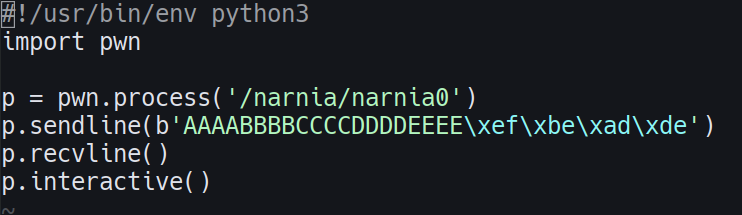

and from there, we can run it and we're granted a shell!

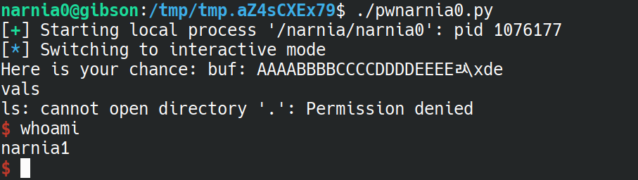

We can now read `/etc/narnia_pass/narnia1` and we get out flag :)

flag=WDcYUTG5ul

## Narnia1 --> Narnia2:

This time we are told to "Give me something to execute at the env-variable EGG."

I tried just setting EGG to a shell command:
`$ env EGG='echo hello' ./narnia1`

but this just gave me a segmentation fault.

I decided to look a look at the source code, `narnia1.c`.

In it, we run `getenv` on "EGG", and save it in a variable called `ret.` We then run `ret();`, indicating that this is being treated as a function. 

With this knowledge, we could try writing our own function to gain a shell! Only, our 'code' will have to be machine readable, so we ought to use shellcode.

Running `uname -a` we see that the system narnia runs on is an x86\_64 machine. We therefore look for some shellcode on shell-storm.org for the appropriate processor.

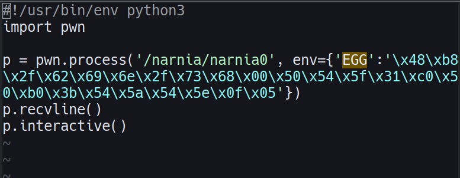

aaaandddd:

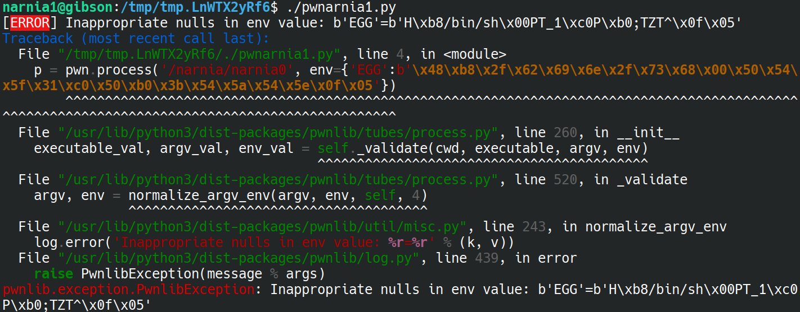

a big ol' error, dang.

The problem here is the NULL byte in our shell code, we're going to need to find some shellcode that does not have that.

Rather than trying to snoop for it myself, I looked up the solution (https://hackmethod.com/overthewire-narnia-1/?v=8bcc25c96aa5) and found out that a working one lives at (http://shell-storm.org/shellcode/files/shellcode-607.html). 

Using that, we're in!

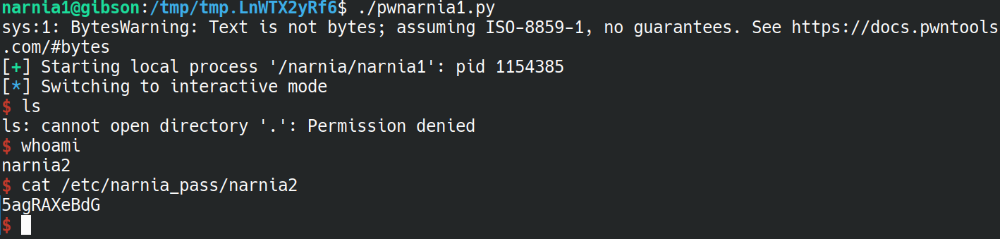

Take away here was learning that you can set environment variables using the 'env' argument in pwn.process() 

flag=5agRAXeBdG

## Narnia2 --> Narnia3:

This time, we're asked to provide a command-line argument while running the binary. Doing so simply echos back whatever we put in, unless... What if the input was very large?

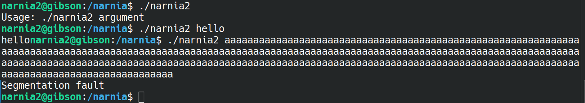

Segfault - that's promising. Once again, let's check source code `narnia2.c` to see how much we'll need to flood the input with `AAAAAAAAAAAAA` until we find when we find when we actually segfault.

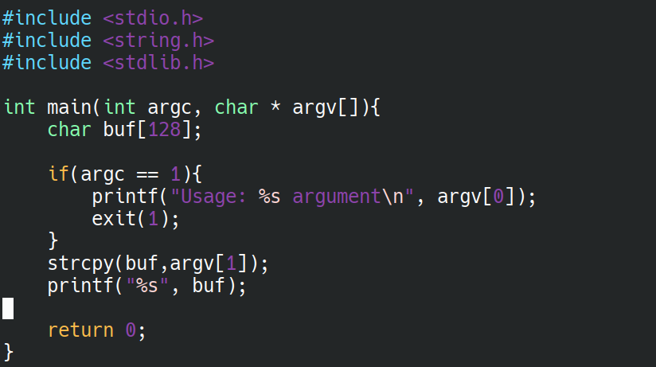

we see that our buffer can fit 128 bytes.

The general idea here is similar to the wargames on the comp6841 ctfd website - we put in our shellcode, and overwrite the return address to point back to our buffer so that our code is executed.

There's just one problem - where is the buffer located?

In this case, it's quite nice, the buffer is always in the same spot. We can actually work out the address of the buffer using `ltrace` (remember that from Leviathan?)

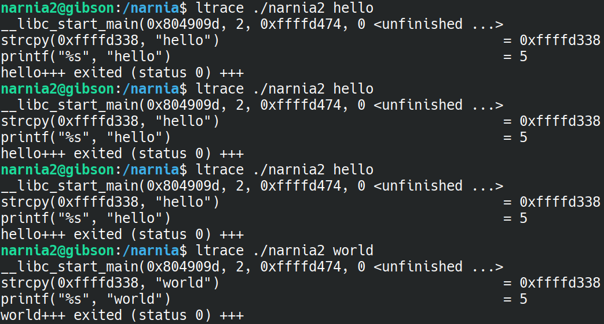

Indeed, running the program a bunch of times shows us that the buffer is located at `0xffffd338`. However, if we use a larger input, we'll actually find that this location changes depending on the size of argv:

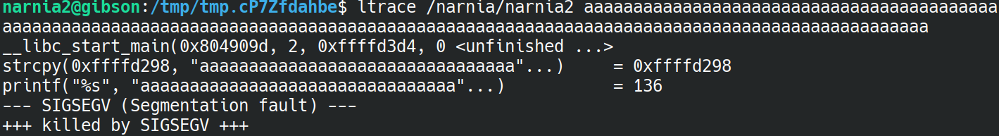

The input in that image is 136 bytes in size - the exact size we will need to overwrite the return address. We see that the address now is `0xffffd298`, so that's the address we'll overwrite our return address with.

Where did I get 136 bytes from? GDB of course!

If we fill up our 128 byte buffer with A's, followed by BBBBCCCCDDDDDEEEE..., then we can easily find the return address - it will be whatever is inside the `%EIP` register when we eventually segfault.

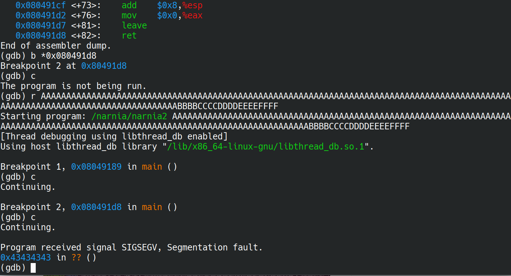

We see that we segfault at `0x43434343`, aka where the C's are. So, that's where I got the 136 number from - 128 As, 4 Bs and 4Cs. The Cs we will now replace with `\x98\xd2\xff\xff` - the return address with appropriate endianness.

When all is said and done, `pwnarnia2.py` is born, and we run it:

yippee!

Big take away here was learning that pwn.process() accepts a list as an argument, and that list is your argv.

flag=2xszzNl6uG

## Narnia3 --> Narnia4:

Running this code this time expects a file as an argument. Providing an argument to a non-existent file throws an error, and providing an argument to an existing file writes the file's content to `/dev/null`.

Having a look at the source code right away, we notice that there are 3 main buffers: `ofile`, `ifile` and `buf`.

In particular, the `ifile` has whatever is inside `argv[1]` copied into it using `strcpy` - immediately that tells us that we can overflow the buffer!

Having a skim through the rest of the file does not reveal anything too helpful. So whatever our exploit is, it's going to be something to do with overflowing the `ifile` buffer.

In particular, overflowing the ifile buffer will overflow INTO the ofile buffer - this is perfect! This means we can over write where the contents of a file gets sent to, instead of `/dev/null`.

So that's our plan, we'll send the contents of `/etc/narnia_pass/narnia4` to some other location.

We'll make a temporary output file and send our contents to that (my temp file was at `/tmp/5Ny0ChdR`).

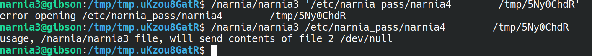

Ok, maybe I got a bit excited. If I include the quotation marks, it tries to specifically open that file, but if I do not, then it just reads the first argument and ignores the rest.

What we need to do is to perfectly fit the `ifile` into the 32 bytes - to do THAT, we'd need to control the name of the file. But we can! With symlinks :)

I create a symbolic link to the password file, and place that into a new directory called 'aaaaaaaaaaaa' (just to overflow the buffer). After the a's, we put the name of the file to write to.

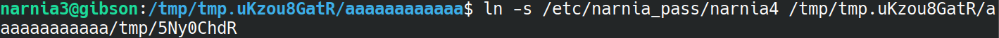

Ok, what's happening here is a bit complicated.

When `open` is called on the `ifile`, it is going to open the entire file name `/tmp/tmp.uKzou8GatR/aaaaaaaaaaaa/tmp/5Ny0ChdR` - but that is exactly the symlink to the password file, so in effect, we are just opening the password file.

Now, when `open` is called on the `ofile`, it only sees the `/tmp/5Ny0ChdR` part, since that's the part that got overwritten into the `ofile` buffer, and so that is the location that we write to.

Wheew, alright, let's run the binary and see if it worked!

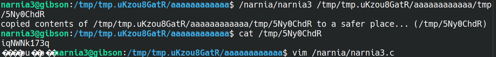

Amazing! This one was lots of fun, I think it was a bit simple but still a really elegant solution!

flag=iqNWNk173q

## Narnia4 --> Narnia5:

This one is a very straightforward buffer overflow, similar to the one from before - just overwrite the return address so that it points back to the start of the buffer. The buffer is of size 256 bytes, so we'll probably need to put in 256 + 4 = 260 bytes, and then the last 4 bytes are the return address to give a total of 264 bytes.

Running `ltrace` with an `argv[1]` just being 264 A's, we discover the buffer address is consistently located at `0xffffd1b4`.

We now just reuse `pwnarnia2.py` and update some numbers, including the binary, padding and the retaddr. Since we have not changed machines, we can just re-use the shellcode.

Hi, me from 2 hours in the future. I expected this to be a really quick 5 minute job where I just adapt `pwnarnia2.py` before I go to bed. Well, it's now 2:15am and I just keep getting "illegal instruction," so idk what's happening. Time to go to bed.
