# NATAS

## Natas0 --> Natas1:
Very simple, just inspect element and the flag is an HTML comment

## Natas1 --> Natas2:
Same thing, just hit F12

## Natas2 --> Natas3:
First interesting one. "There is nothing on this page" implies that we need to go to some other page. In the HTML we have an image under "files/image.png."

My first impression was to see if the image contained any metadata, so I checked the metadata and came up with nothing.

I knew from setting up my public\_html on CSE that websites do often have file structures, and that this image lives under a directory called "files." So, we navigate to that directory (natas2.natas.labs.overthewire.org/files), and the flag is under users.txt.

## Natas3 --> Natas4:
Having never done CTFs before, I already got stuck here for 20 minutes, and had to check the solution. This is not a bad thing, because now I have an opportunity to learn something new!

I learnt that websites can avoid being seen by Google or other web-bots by using a file called "robots.txt." And indeed, natas3.natas.labs.overthewire.org/robots.txt exists!

Navigating to that, we see that the website that cannot be seen by web-bots is a directory called "s3cr3t," so navigating to natas3.natas.labs.overthewire.org/s3cr3t immediately gives us the flag.

Out of curiosity, I checked if facebook.com had a robots.txt, and lo and behold: https://facebook.com/robots.txt
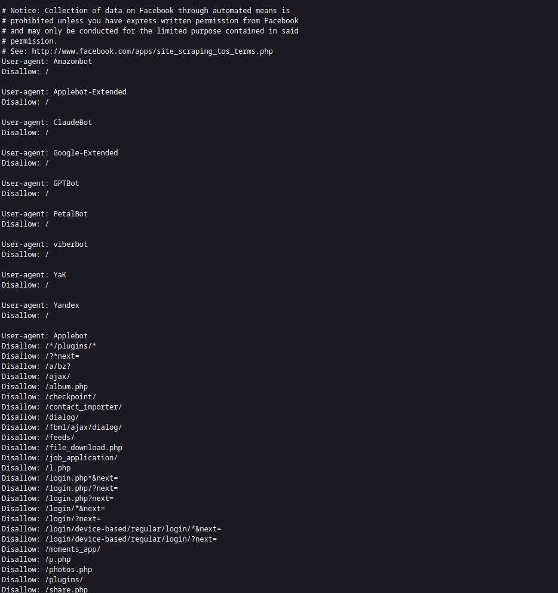

## Natas4 --> Natas5:
'Authorized users should only come from natas5.' Somehow, natas4 is checking which website we came from. I know from COMP3311 networks that an HTTP header is often used to send all kinds of information - maybe that information is stored there?

Checking out the wikipedia page for HTTP headers, there is in fact a header called "referer." Perhaps we can modify this so that we can gain access?

By default, the `$ curl` command sends an HTTP request, maybe the man page has something useful?

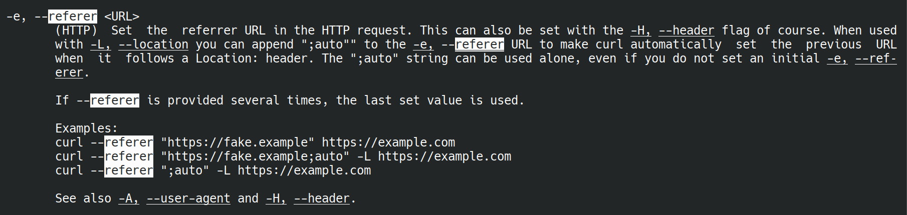

Indeed it does. Let's use curl to enter the login details to get into natas4, and also set the 'referer' header to be natas5.natas.labs.overthewire.org.

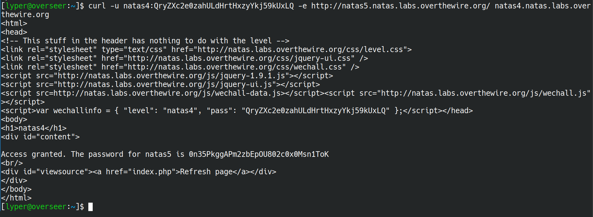

And there we have the flag.

## Natas5 --> Natas6:
This time we are simply told that we are "not logged in." How does a website know if we are logged in or not? In order to store information about users, websites will use cookies. The nice thing about cookies is that they are stored partially on the local end and partially on the server end. If they're stored locally, we can modify them!

Hitting F12 and going to "Storage" and then "Cookies" shows a 'loggedin' cookie with a value of '0.' We'll change this to 1, and voila, flag obtained.

## Natas6 --> Natas7:

We are given a prompt to "input secret," with a button called "Submit query." Immediately this makes me think of SQL. Before checking the sourcecode, I try inputting:
` secret" OR "1" = "1"; -- `
and then
` secret' OR '1' = '1'; -- `
Neither works, so I cave and look at the source code.

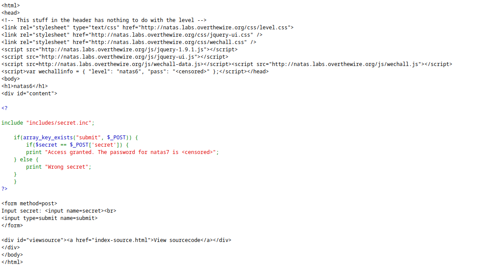

The stuff enclosed by the <? ?> tags is PHP, which I do not know much about, so time to learn a little bit!

I used w3schools.com and just had a look through the PHP tutorial pages, I did not really try to write any PHP myself.

After having a look through, I couldn't <i> really </i> find too much that I could exploit in terms of injection. Maybe there is a way? I'm not too sure at the moment, but it's something I wrote down to explore later.

Instead, I had a look to see if there was anything else of interest. There was the line: 
`include "includes/secret.inc".`

This looks very much like #include in C, where you source functions from a file - maybe we can access that file?

Navigating to natas6.natas.labs.overthewire.org/includes/secret.inc and hitting F12 reveals the "secret," and inputting that password gives us the flag - neat, no programming even required!

flag=bmg8SvU1LizuWjx3y7xkNERkHxGre0GS

## Natas7 --> Natas8:
We are given hyperlinks to the 'home' and 'about' pages. The hint in the HTML inspector says that the password for webuser natas8 is in /etc/natas\_webpass/natas8.

Simply replacing ?page=home with ?page=/etc/natas\_webpass/natas8 gives us the flag.

flag=xcoXLmzMkoIP9D7hlgPlh9XD7OgLAe5Q

## Natas8 --> Natas9:
Another query. Let's view the source:

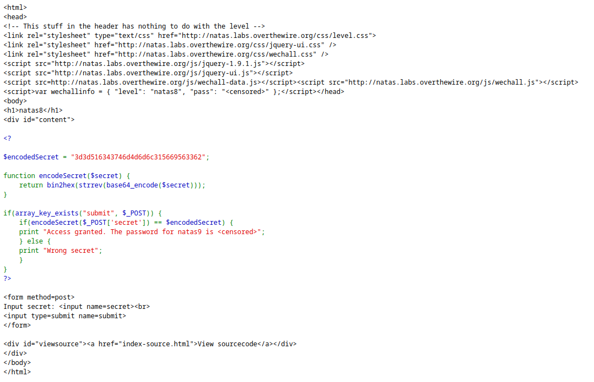

We have an encodedSecret: 3d3d516343746d4d6d6c315669563362

to encode the secret, it uses a function called `base64_encode`, followed by `strrev` (probably string reverse?), followed by `bin2hex.`

Let's just try reversing all of these, converting hex2bin, strrev again, and then base64\_decoding. All of these can be done using online tools at onlinephp.io.

flag=ZE1ck82lmdGIoErlhQgWND6j2Wzz6b6t

## Natas9 --> Natas10:
A dictionary searcher! Inputting a \* character gives us the source code, or you can just click "view sourcecode".

The command run is `passthru("grep -i $key dictionary.txt");`.

We can most definitely inject something into this, since there are no quotes are the `$key` argument!

We know from before that all of the flags are stored in `/etc/natas_webpass/natasX,` so maybe we can inject `$ cat /etc/natas_webpass/natas10`? Let's try it!

Inputting `a; cat /etc/natas_webpass/natas10;` does the trick.

flag=t7I5VHvpa14sJTUGV0cbEsbYfFP2dmOu

## Natas10 --> Natas11:
Now they filter on certain characters... Specifically, the characters `[;|&]` are not allowed.

As we learnt in COMP6841, blacklisting is not a good idea, there are work arounds!

In this case, we just have to get more creative. 'grep' can still be used to print out the complete contents of a file using `grep .* <FILE>`. Since we can use spaces, let's run grep on the natas11 webpass file!

`grep .* /etc/natas_webpass/natas11.`

And it works.
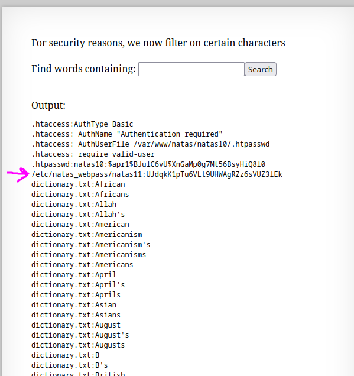

flag=UJdqkK1pTu6VLt9UHWAgRZz6sVUZ3lEk

## Natas11 --> Natas12:

We can change the background colour by putting in the RGB value for that colour. So of course, we change our background to the best colour:

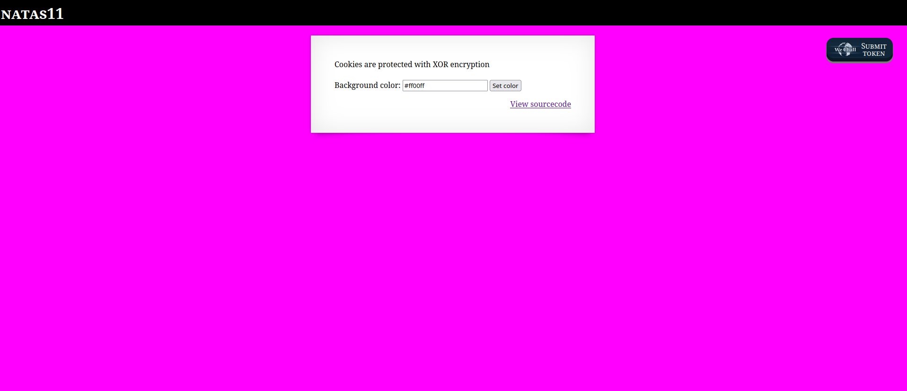

We are told that "cookies are protected with XOR encryption."

Looking through the source code, it seems we check if we have a cookie - if we do, we update the data (the background colour and the "showpassword" option) based on what is inside the cookie. Otherwise, it loads default data.

Maybe if we create our own cookie? We do not know exactly how xor\_encrypt works though, as we do not know the key used to form the XORs. If we can get the key, then we can create our own cookie to get the password.

Maybe we can work out the key by sampling inputs and seeing the outputs? That sounds hard...

I also learnt that json\_encode literally just transforms a PHP array into a JSON array.

By now, it's been a while, and after looking through the code for any other ways of cracking it, I gave up and checked the solutions. (https://medium.com/@n01s/solving-natas-11-df246fcf7828).

From here, we learn the following very useful facts about XOR encryption:

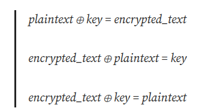

We know that, by default, `$plaintext = array( "showpassword"=>"no", "bgcolor"=>"#ffffff");,` and we know the corresponding encrypted\_text just by looking at the cookies in the F12-menu. So, if we create our own version of `xor_encrypt,` using as input the encrypted\_text and using as a key the plaintext, that should give us our key! Let's try it.

First we get the key:

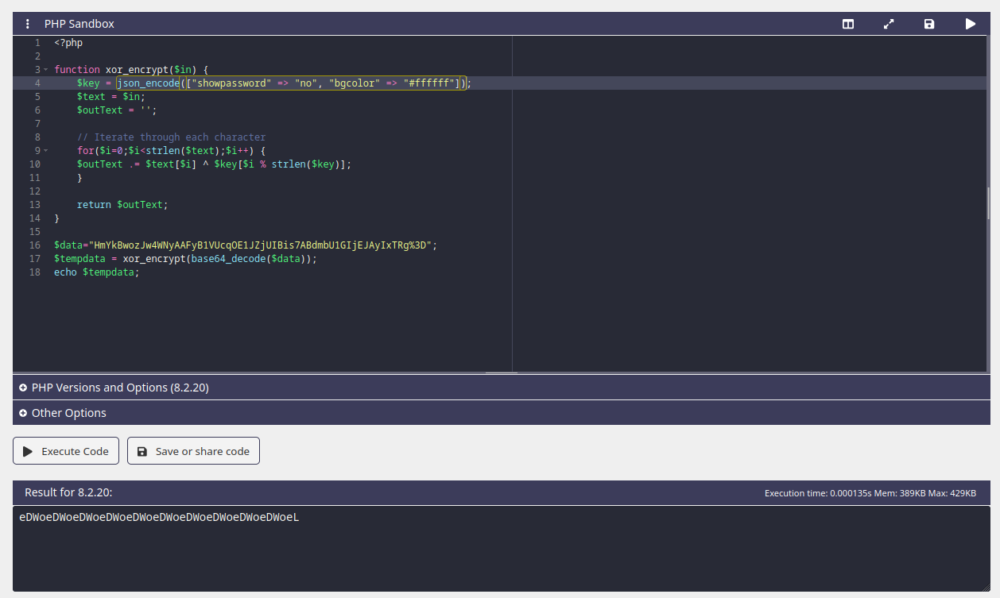

We see that the key is probably "eDWo." Using that as the key to generate our own cookie:

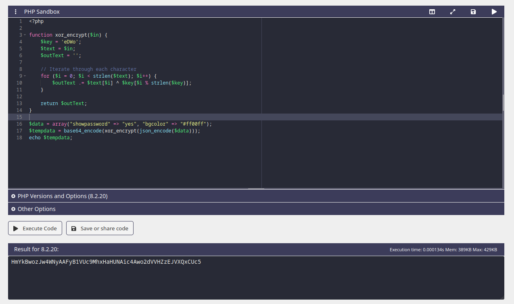

(Yes, we are setting the bgcolor to #ff00ff again, this time in the cookie we are generating. I have to see if it works!).

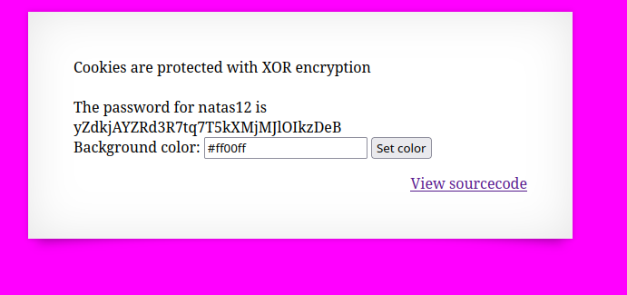

Bingo. This makes me want to look further into how to break certain encryption algorithms - exploiting the XOR operator's inverse being XOR itself, I am guessing, is just one way we could break encryption. 

flag=yZdkjAYZRd3R7tq7T5kXMjMJlOIkzDeB

## Natas12 --> Natas13:

Having a look at the source code, there does not seem to be any checks made that will grant us the new flag. More than likely, we're going have to find the flag somewhere else.

After spending all my time staring at the php code trying to figure out how to exploit it, I did not come up with much.

We have the ability to upload our own files. Although the website says we should upload a JPEG, there does not appear to actually be any checks made on the type of file we upload. So, more than likely, we can upload our own php file!

Now, since I have not learned php, I am going have to get some help. I once again look for some solutions, and came across https://learnhacking.io/overthewire-natas-level-12-walkthrough/. 

The solution makes reference to something called a "webshell," I note this down as something to learn about later, as this is probably going to come in really handy in the future (on second thought, I probably was already using a 'webshell' back in natas9, when we were calling 'grep'!)

Another useful thing I learnt from the solution is that we the file, when uploaded, is automatically changed to ".jpg" in the webpage source code - we can literally just edit this ourselves by changing "jpg" to "php," that'll probably come in handy later!

Anyways, uploading our shell.php script:

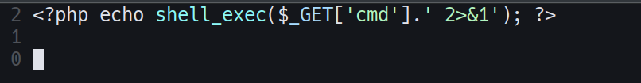

we can now execute shell commands by appending `?cmd=<COMMAND>` to the end. Here I also learnt that we can input ASCII into a URL by using `%<HEX>`, where `<HEX>` is just the hex representation of whatever character we want to include, e.g a space is `%20`.

Because I wanted to learn more about this webshell, I decided I would just try to create a file in the directory where everyone uploads their things - running `?cmd=touch%20hello_there` and then running `?cmd=ls`, we can find my file among all the other things people have uploaded! Pretty neat.

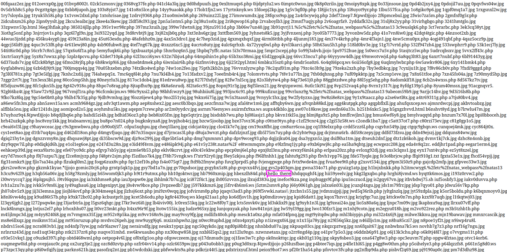

Just to play around with the webshell a bit more, I made a small bash script that let's me interact with the webshell without having to constantly type things into the URL.

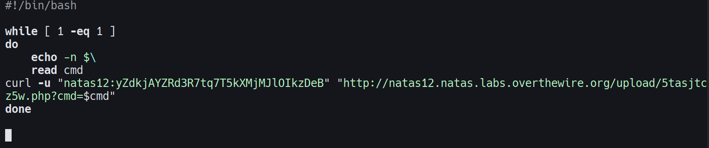
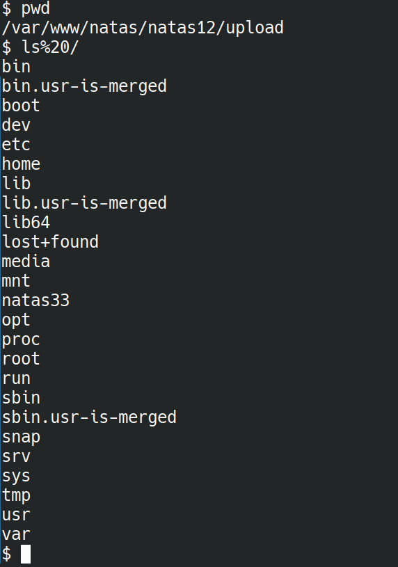

Something I could possibly add is automatic conversion of ASCII symbols to the corresponding URL code (so I do not have to type in %20 to mean 'space')

flag=trbs5pCjCrkuSknBBKHhaBxq6Wm1j3LC

## Natas13 --> Natas14:

Now we can only upload image files... Maybe we can make our file look like an image?

What determines if a file is an image? I first tested just renaming my "shell.php" file to "shell.jpg" and uploading, but that did not work - it detected that it was still not an image.

A quick Google search of the "exif\_imagetype" function told me that it's really just checking the first four bytes of the file - the magic number of the file (like TABI/TBBI/TCBI in COMP1521). So, what if I just chuck the four bytes for JPG at the start of my .php file?

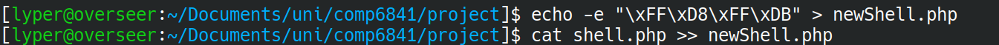

Uploading that...

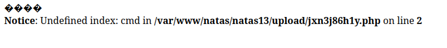

Too easy.

flag=z3UYcr4v4uBpeX8f7EZbMHlzK4UR2XtQ

## Natas14 --> Natas15:
Username and password entry... Okay SURELY this is SQL right? Let's try it:

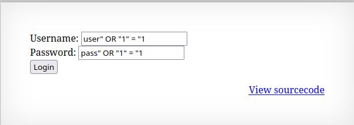
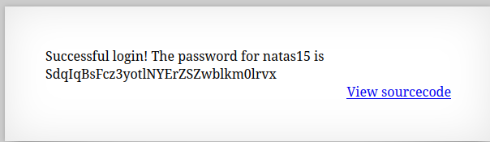

And this time, I was rewarded without needing to check the source code!

All luck this time, of course!
flag=SdqIqBsFcz3yotlNYErZSZwblkm0lrvx
## Natas15 --> Natas16:

Check existence of a username, probably more SQL injection?

Just trying to guess at the query, it's probably something like
`SELECT * FROM <tablename> WHERE username = "<user input>";`

Checking the sourcecode, I was right, with the tablename being 'users.'

Trying the usual input of:
`admin" OR "1" = "1`

we simply get "This user exists."

Realistically, we want to do more than just check existence - we want the usernames and passwords!

Specifically, we'll probably want the password of the user named "natas16," which we can verify does exist using the prompt.

So, how do we get the password? The only thing the prompt will print out is one of the three print statements in the source code, none of which tell us anything about the user.

My mind goes to somehow cause an error, and inside that error will be printed out the username and password. I have absolutely no clue how to do this though.

Another thing is that we could try artifically making the query more complicated - we know that natas16 exists, what if we also start to check his password? In SQL, you can do this with the `LIKE` command. So, you could probably slowly piece together the password like that, but it'd take too much time.

At this point, I could stuck, and decided to just check the solution, and... The solution I found (https://medium.com/@samarthkokil64/overthewire-updated-natas-walkthrough-level-15-951493ef7d30) pretty much says what I did - except they decided that "it'd take too much time" simply is not true, and wrote a python script to get the password!

Here's another learning point - if you have a potential solution, but dismiss it for things like "it'd take too long" or "it's too hard," atleast give it a go!

So, with this knowledge, I'm going to try to write my own script to slowly piece together this flag.

Cobbled together with duct tape, hopes and dreams, I present to you: bruteForce.py

Does it work? Yeah. But it's slow and it sucks and I should probably learn how to use Python rather than spawning a subshell to run cURL and grep lol

Anyway, I got the flag!

flag=hPkjKYviLQctEW33QmuXL6eDVfMW4sGo

## Natas16 --> Natas17:
Another 'grep' type problem, this time with even more banned characters! Again, as we learnt in lecture... Blacklisting is not a good solution!

Notably, they forgot to ban `$, (` and `)`, which means we still have access to subshells!

And indeed, trying some inputs with grep:

`$(grep a /etc/natas_webpass/natas17`

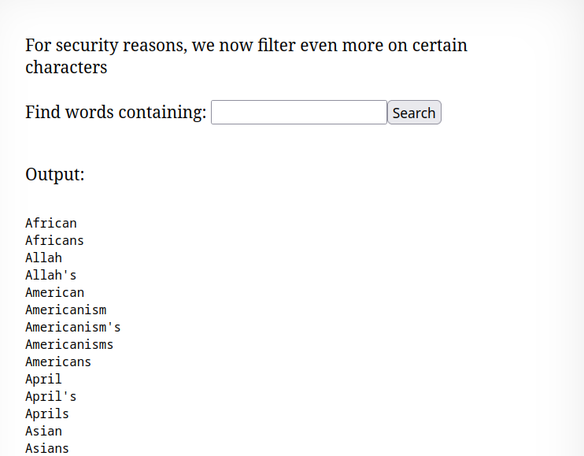

`$(grep b /etc/natas_webpass/natas17`

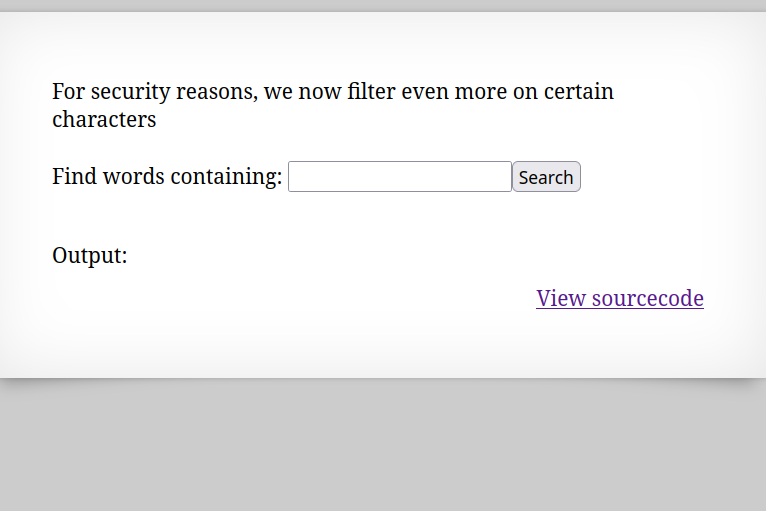

Taking some inspiration from the previous problem, we can probably piece together the flag by querying the website one character at a time. If output appears, that tells us that the character is not part of the flag - if output does NOT appear, the character IS part of the flag (since the whole flag from `/etc/natas_webpass/natas17` will be passed to `grep` for the `dictionary.txt` file)

Adapting our brute force python script from before, this time using the 'requests' module from python (inspired from the last exercise!), we have: `BruteForceNatas16.py`

(You can tell I'm good at naming things)

Even though it is slow (probably cause I'm in Australia), I must say it is very satisfying watching the flag slowly appear.

flag=EqjHJbo7LFNb8vwhHb9s75hokh5TF0OC

## Natas17 --> Natas18:
Same as Natas 15, only this time nothing is printed out! Since nothing else is ever outputted, we'll need some other way to determine was is happening. Maybe a timing attack? I'm not sure how to go about this though, as the database only has one element in it, and that's natas18, so measuring the time it takes for the query to finish and move into $res does not seem very reliable...

From here: `https://www.abatchy.com/2016/12/natas-level-17` I was made aware of the 'sleep' function in SQL... Now that could definitely be useful! If the query answer is 'yes,' we can sleep for some amount of time in response. If the query answer is 'no', then it will be fast. Measure the time it takes to perform each query (and pray to whatever Gods may listen that my internet does not drop out), and we should be able to piece together the flag that way!

...And once again, after editing the python script I had from Natas16, I slowly piece together the flag for Natas17 :)

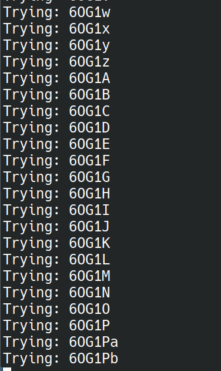

flag=6OG1PbKdVjyBlpxgD4DDbRG6ZLlCGgCJ

## Natas18 --> Natas19:

This time, we are prompted for a username and password. According to the source code, cookies are used to track sessions - maybe we can try spoofing the cookie? 

The maxid is 640 (also from the source code), so let's try incrementing our cookie value from 0 to 640 and see if that let's us in!

A quick Google search tells us how to change the value of cookies in python. We can simply put it into the 'cookies' field in our session.post request! And thus was born, `bruteForceNatas18.py`.

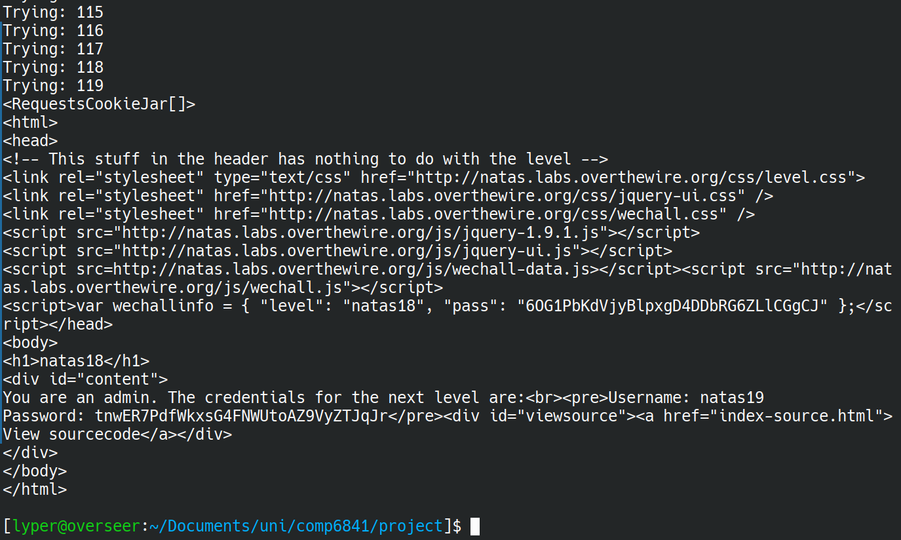

And there's our flag!
flag=tnwER7PdfWkxsG4FNWUtoAZ9VyZTJqJr

## Natas19 --> Natas20:

"This page uses mostly the same code as the previous level, but session IDs are no longer sequential."

Our brute-force attack for the cookie is over! Indeed, checking the cookie gives us a value that is not a nice number...

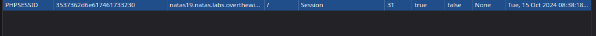

It looks like the value is encoded somehow. The numbers are all between 0 and f, which makes it likely that this is somehow hex-encoded. Whacking the value in the cookie into `https://cryptii.com/pipes/hex-decoder` gives us:

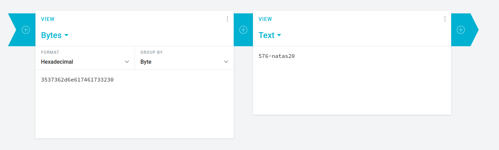

And there we go, the only extra step is to first encode our value (along with the salt, which appears to just be the username you enter), and THEN submit the cookie.

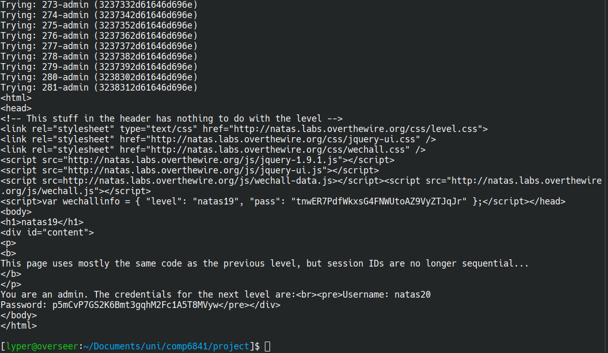

flag=p5mCvP7GS2K6Bmt3gqhM2Fc1A5T8MVyw
